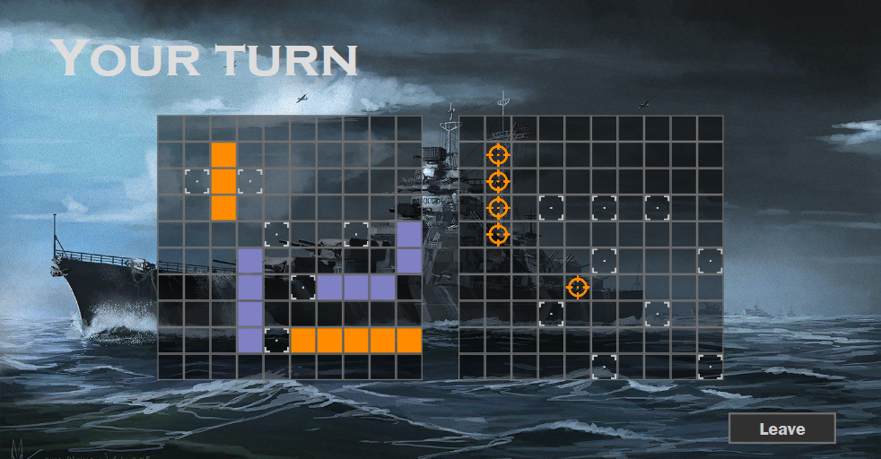

# Battleship
Projekt z przedmiotu Sieci komputerowe (2020 r.)

Autor: Mateusz Bąk\
Politechnika Poznańska, Wydział Informatyki

## Kompilacja

### Serwer - Linux
Wymagania:
- CMake 3.8
- Kompilator C++11
```
cmake -G "Unix Makefiles" .
make
```
Plik wykonywalny: `BattleshipServer/BattleshipServer`

### Klient - Windows
Wymagania:
- .NET Core 3.1 SDK
```
dotnet build -c Release
```
Plik wykonywalny: `BattleshipClient\bin\Release\netcoreapp3.1\BattleshipClient.exe`
